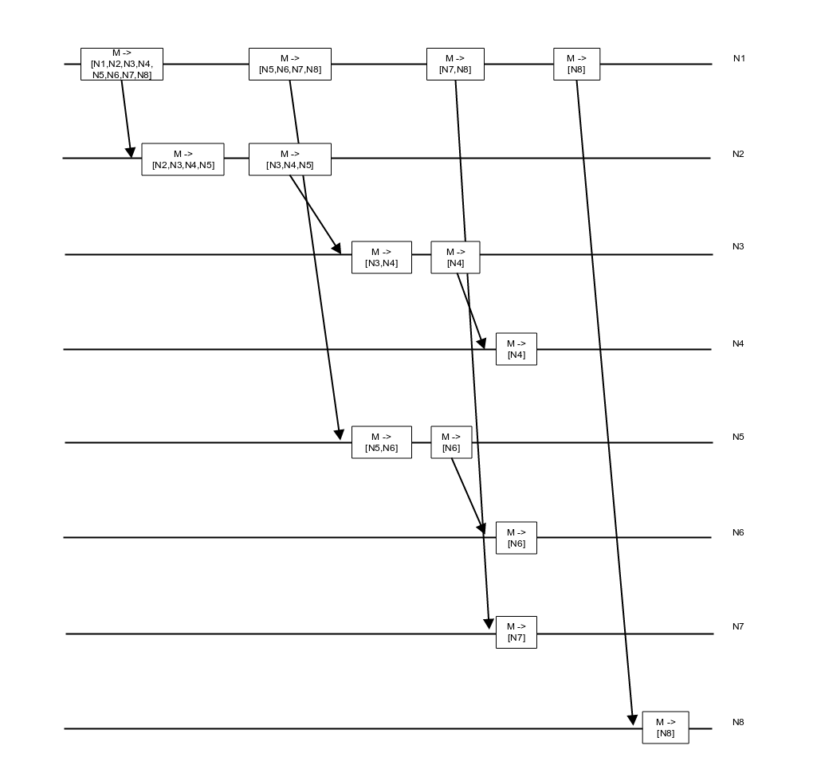
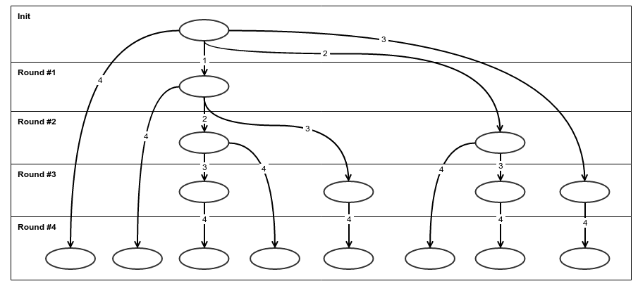
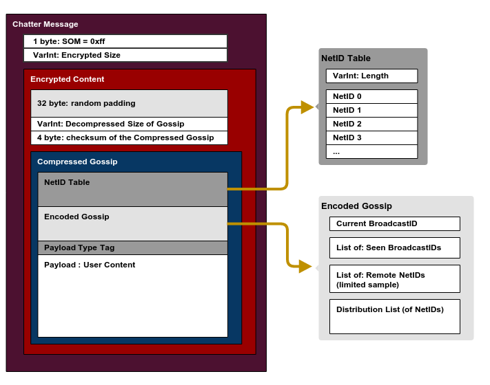

# Chatter docs

## TOC

- [Overview](../docs/#overview)
- [Message format](../docs/#message-format)
  + [VarInt](../docs/#varint)
  + [The message structure](../docs/#the-message-structure)
  + [Message header](../docs/#message-header)
  + [Encrypted Content](../docs/#encrypted-content)
  + [Compressed Gossip](../docs/#compressed-gossip)
  + [NetID Table](../docs/#netid-table)
  + [NetID Entry](../docs/#netid-entry)
  + [Encoded Gossip](../docs/#encoded-gossip)
  + [BroadcastID Entry](../docs/#broadcastid-entry)
  + [List of BroadcastIDs](../docs/#list-of-broadcastids)
  + [List of NetIDs](../docs/#list-of-netids)

## Overview

Chatter library allows efficient and secure broadcasting messages to a set of nodes. It does not guarantee delivery since it uses UDP multicast on the local network, neither does guarantee one time delivery. Chatter has a few measures against message loss.

Chatter focuses on efficient message delivery by discovering network topology and building a logarithmic distribution tree. The tree instructs nodes to deliver messages on behalf of other nodes.

Chatter further optimizes the message distribution by removing nodes from the distribution tree that are available through UDP multicast and dispatches the message through multicast.

### How distribution tree works for the simple TCP case





### How UDP optimization works

Chatter attaches a extra information to each packets it sends out:

- own ID
- seen IDs on UDP multicast
- few random node IDs
- distribution list

### Seen IDs

When Chatter


## Message format

### VarInt

Chatter uses variable length unsigned integers similar to the Protocol Buffer encoding at multiple places:

- this is a sequence of Uint8-s
- if the most significant bit is set, it tells there are more bytes to follow
- the least significant 7 bits contains the value

The encoder does this:

- if value is < 128 -> append: value, end
- if value is > 128 -> append: rem(value,128), continue with div(value, 128)

In Elixir:

```elixir
  defp encode_uint_(binstr, val)
  when val >= 128
  do
    encode_uint_(<< binstr :: binary, 1 :: size(1), rem(val, 128) :: size(7) >>, div(val, 128))
  end

  defp encode_uint_(binstr, val)
  when val < 128
  do
    << binstr :: binary, 0 :: size(1), val :: size(7) >>
  end
```

[The encoder code is available here](../lib//serializer.ex#L159) and the [decoder is here](../lib/serializer.ex#L166)

### The message structure



### Message header

| Offset | Size     | Field Name        | Description                                                          |
| ------ | -------- | ----------------- | -------------------------------------------------------------------- |
| 0      | 1        | SOM               | Start Of Message, always 0xff                                        |
| 1      | Variable | Encrypted Size    | **VarInt**: size of the **Encrypted Content** that follows           |

### Encrypted Content

The message content is compressed with AES-256-CTR where:

- **IV** is "-- ScaleSmall --"
- **key** is 32 bytes of user supplied key, with the following rules applied:
  + If **key** is longer than 32 bytes, it will be chopped
  + If **key** is shorter than 32 bytes, "01234567890123456789012345678901" will be concatenated and chopped to 32 bytes

| Offset | Size     | Field Name        | Description                                                          |
| ------ | -------- | ----------------- | -------------------------------------------------------------------- |
| 0      | 32       | Padding           | 32 bytes random data                                                 |
| 32     | Variable | Decompressed Size | **VarInt**: Size of the *decompressed* Gossip                            |
| *      | 4        | Checksum          | Big Endian: XXHash-32 checksum of the compressed Gossip that follows |
| *      | Variable | CompressedGossip  | Gossip data compressed with **Snappy**                               |

### Compressed Gossip

The Gossip has these parts:

| Offset | Size     | Field Name          | Description                                                        |
| ------ | -------- | ------------------- | ------------------------------------------------------------------ |
| 0      | Variable | NetID Table         | Lookup table for efficient compression of redundant NetID information |
| *      | Variable | Encoded Gossip      | The extra data that allows Chatter to discover nodes and broadcast efficiently |
| \*     | Variable | Payload Type Tag    | **VarInt**: Identifies the user mesage type so the receiver will know how to decode the user message content |
| *      | Variable | User content        | |

### NetID Table

NetID's are central to `Chatter` and used in many places, often redundantly, for that reason they are extracted from the Gossip content into a table. The table positions (from 0) identify the NetID entries and these positions are used in the Gossip encoding as a reference to the given NetID.

| Offset | Size     | Field Name          | Description                                                        |
| ------ | -------- | ------------------- | ------------------------------------------------------------------ |
| 0      | Variable | NetID Table Length  | Number of NetID entries in VarInt format (see description below)   |
| *      | 6        | NetID entry         | See below                                                          |

### NetID Entry

| Offset | Size     | Field Name          | Description                                                        |
| ------ | -------- | ------------------- | ------------------------------------------------------------------ |
| 0      | 1        | A                   | A in the **A**.B.C.D of IPv4 address                               |
| 1      | 1        | B                   | B in the A.**B**.C.D of IPv4 address                               |
| 2      | 1        | C                   | C in the A.B.**C**.D of IPv4 address                               |
| 3      | 1        | D                   | D in the A.B.C.**D** of IPv4 address                               |
| 4      | 2        | Port                | Big Endian: unsigned short port number                             |

### Encoded Gossip

This part holds the extra information that allows `Chatter` nodes to optimize message deliver and discover each other.

| Offset | Size     | Field Name           | Description                                                        |
| ------ | -------- | -------------------- | ------------------------------------------------------------------ |
| 0      | Variable | Current Broadcast ID | **BroadcastID**: Identifies the sender, see the encoding below     |
| \*     | Variable | Seen Broadcast IDs   | **List of BroadcastIDs**: tells from whom the broadcaster has seen *UDP multicast messages* |
| \*     | Variable | Remote NetIDs        | **List of NetIDs**: telling others about the rest of the world (see explanation below) |
| \*     | Variable | Distribution list    | **List of NetIDs**: who should receive this `Chatter` message (see explanation below) |

### BroadcastID Entry

| Offset | Size     | Field Name           | Description                                                        |
| ------ | -------- | -------------------- | ------------------------------------------------------------------ |
| 0      | Variable | NetID reference      | **VarInt**: refers to the **NetID Table**                          |
| \*     | Variable | Sequence number      | **VarInt**: bumped at every new broadcast                          |

### List of BroadcastIDs

| Offset | Size     | Field Name           | Description                                                        |
| ------ | -------- | -------------------- | ------------------------------------------------------------------ |
| 0      | Variable | Length               | **VarInt**: number of BroadcastIDs to follow                       |
| \*     | Variable | BroadcastID \*       | **BrodcastID** entries                                             |

### List of NetIDs

| Offset | Size     | Field Name           | Description                                                        |
| ------ | -------- | -------------------- | ------------------------------------------------------------------ |
| 0      | Variable | Length               | **VarInt**: number of NetID references to follow                   |
| \*     | Variable | NetID reference \*   | **VarInt**: referes to the **NetID Table**                         |


