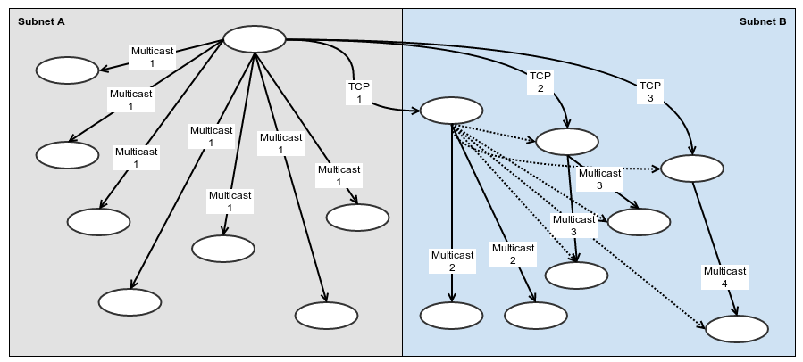
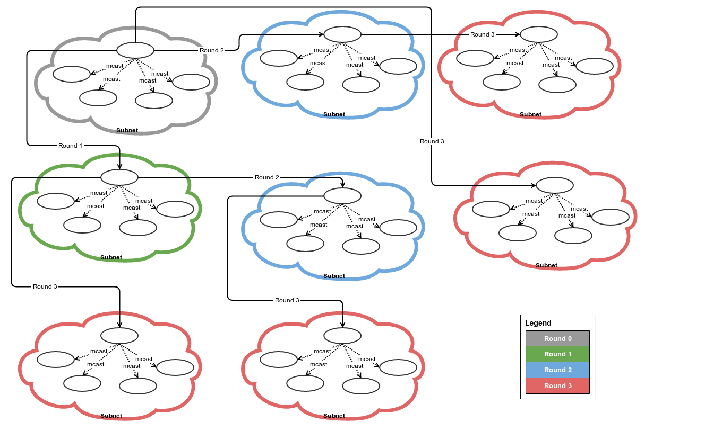

# Chatter docs

## TOC

- [Overview](../docs/#overview)
  + [How distribution tree works for the simple TCP case](../docs/#how-distribution-tree-works-for-the-simple-tcp-case)
  + [How UDP optimization works](../docs/#how-udp-optimization-works)
  + [How to discover non local areas](../docs/#how-to-discover-non-local-areas)
  + [Modified distribution tree](../docs/#modified-distribution-tree)
- [Message format](../docs/#message-format)
  + [VarInt](../docs/#varint)
  + [The message structure](../docs/#the-message-structure)
  + [Message header](../docs/#message-header)
  + [Encrypted Content](../docs/#encrypted-content)
  + [Compressed Gossip](../docs/#compressed-gossip)
  + [NetID Table](../docs/#netid-table)
  + [NetID Entry](../docs/#netid-entry)
  + [Encoded Gossip](../docs/#encoded-gossip)
  + [BroadcastID Entry](../docs/#broadcastid-entry)
  + [List of BroadcastIDs](../docs/#list-of-broadcastids)
  + [List of NetIDs](../docs/#list-of-netids)
- [Quickstart Guide](../docs/#quickstart-guide)
  + [Add dependency](../docs/#add-dependency)
  + [Start the application](../docs/#start-the-application)
  + [Configure](../docs/#configure)
  + [Register message handler](../docs/#register-message-handler)
  + [Broadcast to others](../docs/#broadcast-to-others)
- [FAQ](../docs/#faq)
  + [What nodes are available at startup?](../docs/#what-nodes-are-available-at-startup)
  + [When does Chatter populate the peer database?](../docs/#when-does-chatter-populate-the-peer-database)
  + [How does message encoding work](../docs/#how-does-message-encoding-work)
  + [How does message decoding work](../docs/#how-does-message-decoding-work)
  + [What is a message handler?](../docs/#what-is-a-message-handler)

## Overview

Chatter library allows efficient and secure broadcasting messages to a set of nodes. It does not guarantee delivery since it uses UDP multicast on the local network, neither does guarantee one time delivery. Chatter has a few measures against message loss.

Chatter focuses on efficient message delivery by discovering network topology and building a logarithmic distribution tree. The tree instructs nodes to deliver messages on behalf of other nodes.

Chatter further optimizes the message distribution by removing nodes from the distribution tree that are available through UDP multicast and dispatches the message through multicast.

Chatter attaches a extra information to each packets it sends out:

- own ID
- seen IDs on UDP multicast
- few random node IDs
- distribution list

### How distribution tree works for the simple TCP case

The `distribution list` that is passed along the messages instructs the receiver to forward the message to the nodes on the list. In the simple TCP case, the reciver selects a node from the list and passes the message along with half of the distribution list. All receivers do the same in a loop, so in each round more and more nodes will be involved with less and less work. It is easy to prove that the messages will be dispatched in log n rounds.

Here is an illustration to show the distribution lists:


And an other one that shows the tree aligned as message distribution rounds:


### How UDP optimization works

The drawback of the logarithmic TCP dispatch is that the data travelling on the network explodes when more and more nodes dispatching messages. With a large number of nodes this can be an issue. The funny part is that the message payload would be the same for this message storm.

Chatter discovers the LAN, records and passes information about other nodes so all participants will slowly learn who is available through UDP multicast.

These rules help the optimization:

1. when a node receives a multicast packet, it records the senders ID
2. when a node sends a packet either on TCP or UDP, it sends over the list of IDs it has seen
3. the receiver records whom the sender has seen

Based on the `seen id list` every node can verify if the peer he intends to send a message to has already confirmed that it had seen as an UDP multicast sender. If this holds, then the node is free to remove the recipient from the TCP dispatch tree.

### How to discover non local areas

Chatter will know about other peers on the same LAN quickly. The non local nodes are still a problem though. Based on the `seen id list` Chatter can divide the nodes into distinct sets that are not doing multicast to each other. Chatter then picks a random node from each set and puts them into the `random other nodes list` part of the message. Chatter limits this part not to be more than four at any message. This allows nodes to share knowledge about other parts of the network.

### Modified distribution tree

Originally we had a nicely laid out logarithmic distribution tree and by applying the UDP optimization it became more optimial. The solution in that form is still not perfect. Here is an illustration of the problem:



On `subnet A` we do well, but on `subnet B` there are a few extra unneeded message rounds. This is because the algorithm is not using any information we my have from `subnet B`.

To solve this we need to do a few steps:

- every time a node receives a message for delivery it splits the distibution list into distinct sets based on the UDP `seen ID` lists it has received
- these sets are assumed to be able to communicate to each other using UDP multicast
- the node orginizes these sets into a random list (of distinct sets)
- when it does its message rounds it sends over half of its list (of sets) to the next hop



The randomization ensures that every node will hear about others sooner or later. The algorithm as illustrated above is still logarithmic but in the known multicast groups rather than the induvidual nodes. When all nodes reside on different subnets or UDP multicast is not permitted or not supported, the algorithm works the same way as the original logarithmic broadcast.

## Message format

### VarInt

Chatter uses variable length unsigned integers similar to the Protocol Buffer encoding at multiple places:

- this is a sequence of Uint8-s
- if the most significant bit is set, it tells there are more bytes to follow
- the least significant 7 bits contains the value

The encoder does this:

- if value is < 128 -> append: value, end
- if value is > 128 -> append: rem(value,128), continue with div(value, 128)

In Elixir:

```elixir
  defp encode_uint_(binstr, val)
  when val >= 128
  do
    encode_uint_(<< binstr :: binary, 1 :: size(1), rem(val, 128) :: size(7) >>, div(val, 128))
  end

  defp encode_uint_(binstr, val)
  when val < 128
  do
    << binstr :: binary, 0 :: size(1), val :: size(7) >>
  end
```

[The encoder code is available here](../lib//serializer.ex#L159) and the [decoder is here](../lib/serializer.ex#L166)

### The message structure


### Message header

| Offset | Size     | Field Name        | Description                                                          |
| ------ | -------- | ----------------- | -------------------------------------------------------------------- |
| 0      | 1        | SOM               | Start Of Message, always 0xff                                        |
| 1      | Variable | Encrypted Size    | **VarInt**: size of the **Encrypted Content** that follows           |

### Encrypted Content

The message content is compressed with AES-256-CTR where:

- **IV** is "-- ScaleSmall --"
- **key** is 32 bytes of user supplied key, with the following rules applied:
  + If **key** is longer than 32 bytes, it will be chopped
  + If **key** is shorter than 32 bytes, "01234567890123456789012345678901" will be concatenated and chopped to 32 bytes

| Offset | Size     | Field Name        | Description                                                          |
| ------ | -------- | ----------------- | -------------------------------------------------------------------- |
| 0      | 32       | Padding           | 32 bytes random data                                                 |
| 32     | Variable | Decompressed Size | **VarInt**: Size of the *decompressed* Gossip                            |
| *      | 4        | Checksum          | Big Endian: XXHash-32 checksum of the compressed Gossip that follows |
| *      | Variable | CompressedGossip  | Gossip data compressed with **Snappy**                               |

### Compressed Gossip

The Gossip has these parts:

| Offset | Size     | Field Name          | Description                                                        |
| ------ | -------- | ------------------- | ------------------------------------------------------------------ |
| 0      | Variable | NetID Table         | Lookup table for efficient compression of redundant NetID information |
| *      | Variable | Encoded Gossip      | The extra data that allows Chatter to discover nodes and broadcast efficiently |
| \*     | Variable | Payload Type Tag    | **VarInt**: Identifies the user mesage type so the receiver will know how to decode the user message content |
| *      | Variable | User content        | |

### NetID Table

NetID's are central to `Chatter` and used in many places, often redundantly, for that reason they are extracted from the Gossip content into a table. The table positions (from 0) identify the NetID entries and these positions are used in the Gossip encoding as a reference to the given NetID.

| Offset | Size     | Field Name          | Description                                                        |
| ------ | -------- | ------------------- | ------------------------------------------------------------------ |
| 0      | Variable | NetID Table Length  | Number of NetID entries in VarInt format (see description below)   |
| *      | 6        | NetID entry         | See below                                                          |

### NetID Entry

| Offset | Size     | Field Name          | Description                                                        |
| ------ | -------- | ------------------- | ------------------------------------------------------------------ |
| 0      | 1        | A                   | A in the **A**.B.C.D of IPv4 address                               |
| 1      | 1        | B                   | B in the A.**B**.C.D of IPv4 address                               |
| 2      | 1        | C                   | C in the A.B.**C**.D of IPv4 address                               |
| 3      | 1        | D                   | D in the A.B.C.**D** of IPv4 address                               |
| 4      | 2        | Port                | Big Endian: unsigned short port number                             |

### Encoded Gossip

This part holds the extra information that allows `Chatter` nodes to optimize message deliver and discover each other.

| Offset | Size     | Field Name           | Description                                                        |
| ------ | -------- | -------------------- | ------------------------------------------------------------------ |
| 0      | Variable | Current Broadcast ID | **BroadcastID**: Identifies the sender, see the encoding below     |
| \*     | Variable | Seen Broadcast IDs   | **List of BroadcastIDs**: tells from whom the broadcaster has seen *UDP multicast messages* |
| \*     | Variable | Remote NetIDs        | **List of NetIDs**: telling others about the rest of the world (see explanation below) |
| \*     | Variable | Distribution list    | **List of NetIDs**: who should receive this `Chatter` message (see explanation below) |

### BroadcastID Entry

| Offset | Size     | Field Name           | Description                                                        |
| ------ | -------- | -------------------- | ------------------------------------------------------------------ |
| 0      | Variable | NetID reference      | **VarInt**: refers to the **NetID Table**                          |
| \*     | Variable | Sequence number      | **VarInt**: bumped at every new broadcast                          |

### List of BroadcastIDs

| Offset | Size     | Field Name           | Description                                                        |
| ------ | -------- | -------------------- | ------------------------------------------------------------------ |
| 0      | Variable | Length               | **VarInt**: number of BroadcastIDs to follow                       |
| \*     | Variable | BroadcastID \*       | **BrodcastID** entries                                             |

### List of NetIDs

| Offset | Size     | Field Name           | Description                                                        |
| ------ | -------- | -------------------- | ------------------------------------------------------------------ |
| 0      | Variable | Length               | **VarInt**: number of NetID references to follow                   |
| \*     | Variable | NetID reference \*   | **VarInt**: referes to the **NetID Table**                         |


## Quickstart Guide

- add dependency
- start the application
- set configuration values, especially the encryption key
- register handler
- broadcast to others

### Add dependency

```elixir
  defp deps do
    [
      {:xxhash, git: "https://github.com/pierresforge/erlang-xxhash"},
      {:chatter, "~> 0.0.14"}
    ]
  end
```

### Start the application

```elixir
  def application do
    [
      applications: [:logger, :chatter],
      mod: {YourModule, []}
    ]
  end
```

### Configure

```elixir
use Mix.Config

config :chatter,
  my_addr: System.get_env("CHATTER_ADDRESS"),
  my_port: System.get_env("CHATTER_PORT") || "29999",
  multicast_addr: System.get_env("CHATTER_MULTICAST_ADDRESS") || "224.1.1.1",
  multicast_port: System.get_env("CHATTER_MULTICAST_PORT") || "29999",
  multicast_ttl: System.get_env("CHATTER_MULTICAST_TTL") || "4",
  key: System.get_env("CHATTER_KEY") || "01234567890123456789012345678912"
```

### Register message handler

```elixir
iex(1)> extract_netids_fn = fn(t) -> [] end
iex(2)> encode_with_fn = fn(t,_id_map) -> :erlang.term_to_binary(t) end
iex(3)> decode_with_fn = fn(b,_id_map) -> {:erlang.binary_to_term(b), <<>>} end
iex(4)> dispatch_fn = fn(t) -> IO.inspect(["arrived", t])
  {:ok, t}
end
iex(5)> handler = Chatter.MessageHandler.new(
    {:hello, "world"},
    extract_netids_fn,
    encode_with_fn,
    decode_with_fn,
    dispatch_fn)
iex(6)> db_pid = Chatter.SerializerDB.locate!
iex(7)> Chatter.SerializerDB.add(db_pid, handler)
```

### Broadcast to others

```elixir
iex(8)> destination = Chatter.NetID.new({192, 168, 1, 100}, 29999)
iex(9)> Chatter.broadcast([destination], {:hello, "world"})
```

## FAQ

### What nodes are available at startup

When Chatter starts its peer database is empty. The database of known peers are populated when receiving or sending messages.

### When does Chatter populate the peer database

It populates the peer DB:

- when Chatter sends a message to a set of nodes, then all peer NetIDs will also be saved in the peer database
- when Chatter receives a message on UDP multicast or TCP, it saves these into the peer database:
  + the `sender ID`
  + the `distribution list` in the message
  + the `seen ids list` in the message
  + the `other ids` in the message

### How does message encoding work

The high level flow of message encoding is:

- gather the NetIDs from the Gossip and the Payload (by calling the user supplied `extract_netids` callback)
- create a map of `NetID` -> `Table position`
- encode the Gossip with the help of the NetID map
- inserts a user supplied `Payload Type Tag` into the message
- call a user callback `encode_with` with the Payload and the NetID map to convert the payload to binary

To be able to serialize the user content, Chatter needs a few callbacks to be registered. Please see the details below, in the `MessageHandler` section.

### How does message decoding work

- chatter extracts the NetID table from the incoming message
- converts the NetIDs to a map of `Table position` -> `NetID`
- decodes the `Payload Type Tag` from the message and finds the registered callback for the given message type
- calls the registered `decode_with` callback with the Payload binary and the `Table Postion` -> `NetID` map
- calls the registered `dispatch` function with the result of the decode step

### What is a message handler

To be able to handle messages the user needs to pass five information to the Chatter library:

1. How to match the incoming message types with the user supplied deserialization code?
2. (Optionally) How to extract NetIDs from the user payload if there is any? (`extract_netids`)
3. How to convert the user object to binary? (`encode_with`)
4. How to convert the binary message to an user object? (`decode_with`)
5. What to do with the incoming messages? (`dispatch`)

**Here is a very simple and inefficient illustration:**

```elixir
iex(1)> extract_netids_fn = fn(t) -> [] end
iex(2)> encode_with_fn = fn(t,_id_map) -> :erlang.term_to_binary(t) end
iex(3)> decode_with_fn = fn(b,_id_map) -> {:erlang.binary_to_term(b), <<>>} end
iex(4)> dispatch_fn = fn(t) -> IO.inspect(["arrived", t])
  {:ok, t}
end
iex(5)> handler = Chatter.MessageHandler.new(
    {:hello, "world"},
    extract_netids_fn,
    encode_with_fn,
    decode_with_fn,
    dispatch_fn)
```

The user in this example doesn't want to use the `NetID table`, so the `extract_netids` function returns an empty list. The `encode_with` and `decode_with` functions are using the Erlang serialization functions. The encoder and decoder just ignore the id_map parameter, beause they don't need it. The `dispatch` function prints the incoming record.

The `MessageHandler` also needs to be registered so `Chatter` will know about it:

```elixir
iex(6)> db_pid = Chatter.SerializerDB.locate!
iex(7)> Chatter.SerializerDB.add(db_pid, handler)
```

The first parameter of the message handler takes a tuple and assumes the first element to be an atom. This will be converted to string and a 32 bit checksum of this string will identify the message type both in the SerializerDB and the `Payload Type Tag` field of the message.

`Chatter` assumes that the user passes tuples as message data and the first element of the tuple is an atom that identifies the message type.
