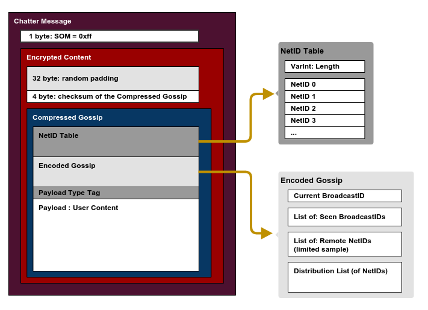

# Chatter docs

## Message format

### Message header

| Offset | Size     | Field Name        | Description                                                          |
| ------ | -------- | ----------------- | -------------------------------------------------------------------- |
| 0      | 1        | SOM               | Start Of Message, always 0xff                                        |
| 1      | 32       | Padding           | 32 bytes random data                                                 |
| 33     | 4        | Checksum          | Big Endian: XXHash-32 checksum of the compressed Gossip that follows |
| 37     | Variable | CompressedGossip  | Gossip data compressed with Snappy                                   |

### Compressed Gossip

| Offset | Size     | Field Name          | Description                                                        |
| ------ | -------- | ------------------- | ------------------------------------------------------------------ |
| 0      | Variable | NetID Table Length  | Number of NetID entries in VarInt format (see description below)   |
| *      | 6        | NetID entry         | See below                                                          |

### VarInt

Chatter uses variable length unsigned integers similar to the Protocol Buffer encoding:

### NetID Entry

| Offset | Size     | Field Name          | Description                                                        |
| ------ | -------- | ------------------- | ------------------------------------------------------------------ |
| 0      | 1        | A                   | A in the **A**.B.C.D of IPv4 address                               |
| 1      | 1        | B                   | B in the A.**B**.C.D of IPv4 address                               |
| 2      | 1        | C                   | C in the A.B.**C**.D of IPv4 address                               |
| 3      | 1        | D                   | D in the A.B.C.**D** of IPv4 address                               |
| 4      | 2        | Port                | Little Endian: unsigned short port number                          |

